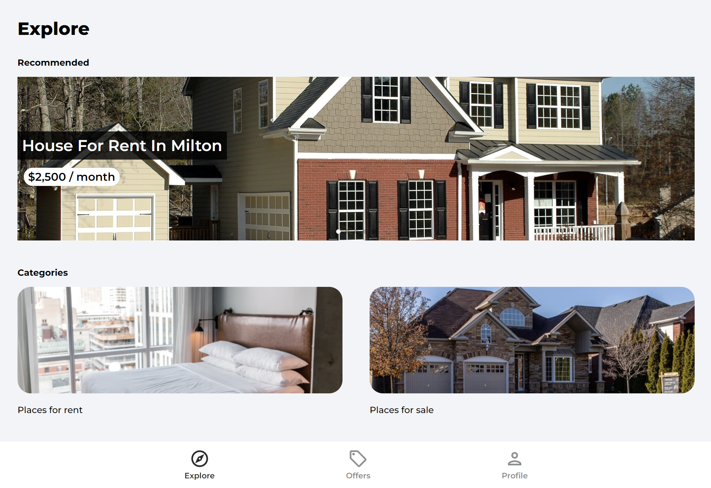

# [House Marketplace](https://house-marketplace-zeta-seven.vercel.app/) ·   



## Description

A house marketplace web app built using React, with a Firebase backend.

### Why Firebase?

This project focuses on React, so this was an opportunity to use cloud-based platform backend that came with its own authentication system and database (Firestore).

### Why React?

I've worked with React on other projects, but I wanted to build a mobile-first web app using React that had a clean interface and focused on simplicity.

## Installation

Here are the things you'll need if you want to run this project locally:

1. [NodeJS](https://nodejs.org/en/download)

Once the above is installed:

1. Clone this repository
2. Open a terminal and navigate to the project's root directory
3. Install the required packages via NPM

   ```shell
   npm install
   ```

## Usage

Rename **_.env.template_** to **_.env_**

Use of the Google Geocoding API requires an API token.

Learn how to create a token [here](https://cloud.google.com/api-keys/docs/create-manage-api-keys)

To run the project locally:

```shell
npm start
```
